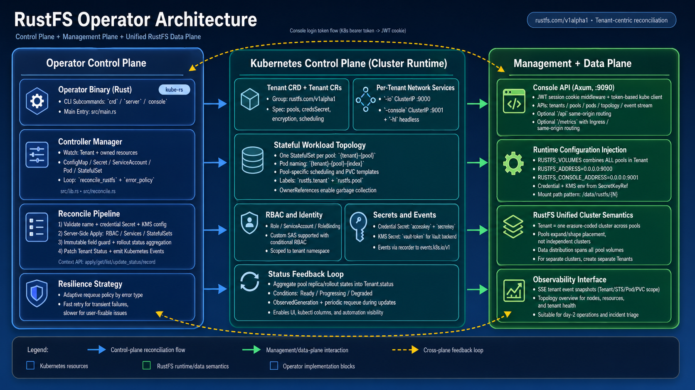

# RustFS Kubernetes Operator

A Kubernetes operator for [RustFS](https://rustfs.com/) object storage, written in Rust with [kube-rs](https://github.com/kube-rs/kube). It reconciles a **`Tenant` custom resource** (`rustfs.com/v1alpha1`), validates referenced credential and KMS Secrets, and applies RBAC, Services, and StatefulSets so RustFS runs as an erasure-coded cluster inside your cluster.

**Status:** v0.1.0 pre-release — under active development, **not production-ready**.

## Features

- **Tenant CRD** — Declare pools, persistence, scheduling, credentials (Secret or env), TLS, and more; see [`examples/`](examples/).
- **Controller** — Reconciliation loop with status conditions (`Ready` / `Progressing` / `Degraded`), events, and safe StatefulSet update checks.
- **Operator HTTP console** — Optional management API (`cargo run -- console`, default port **9090**) used by [`console-web/`](console-web/) (Next.js UI).
- **Tooling** — CRD YAML generation, Docker multi-stage image, Kind-focused scripts under [`scripts/`](scripts/).

RustFS **S3 API** and **RustFS Console UI** inside a Tenant are exposed on **9000** and **9001** respectively; the operator’s own HTTP API is separate (typically **9090**).

## Architecture



## Requirements

- **Rust** — Toolchain from [`rust-toolchain.toml`](rust-toolchain.toml) (stable; edition 2024).
- **Kubernetes** — Target API **v1.30** (see `Cargo.toml` / `k8s-openapi` features); a reachable cluster for `server` mode.
- **console-web** (optional) — **Node.js ≥ 20** and `pnpm install` in `console-web/` if you run frontend lint/format or UI dev.

## Quick start

```bash
# Clone and build
git clone https://github.com/rustfs/operator.git
cd operator
cargo build --release

# Emit Tenant CRD YAML (stdout or file)
cargo run -- crd
cargo run -- crd -f tenant-crd.yaml

# Run the controller (needs kubeconfig / in-cluster config)
cargo run -- server

# Run the operator HTTP console API (default :9090)
cargo run -- console
```

**Docker**

```bash
docker build -t rustfs/operator:dev .
```

**End-to-end on Kind** (single-node or multi-node) — use the scripts under [`scripts/deploy/`](scripts/deploy/), with cleanup and status helpers under [`scripts/cleanup/`](scripts/cleanup/) and [`scripts/check/`](scripts/check/).

## Development

From the repo root:

| Command | Purpose |
|--------|---------|
| `make pre-commit` | Full local gate: Rust `fmt` / `clippy` / `test` + `console-web` ESLint and Prettier (run after `pnpm install` in `console-web/`). |
| `make fmt` / `make clippy` / `make test` | Individual Rust checks. |
| `make console-lint` / `make console-fmt-check` | Frontend only. |

CI (`.github/workflows/ci.yml`) runs Rust tests (including `nextest`), `cargo fmt --check`, and `clippy`; it does **not** run `console-web` checks — use **`make pre-commit`** before opening a PR so frontend changes are validated.

Contribution workflow, commit style, and PR expectations: [`CONTRIBUTING.md`](CONTRIBUTING.md).

## Repository layout

- **scripts/** — Deploy, cleanup, and check scripts
  - `scripts/deploy/` — One-shot deploy (Kind + Operator + Tenant)
  - `scripts/cleanup/` — Resource cleanup
  - `scripts/check/` — Cluster and Tenant status checks
- **deploy/** — Kubernetes / Helm manifests and Kind configs
  - `deploy/rustfs-operator/` — Helm chart
  - `deploy/k8s-dev/` — Development Kubernetes YAML
  - `deploy/kind/` — Kind cluster configs (e.g. 4-node)
- **examples/** — Sample Tenant CRs
- **console-web/** — Operator management UI (Next.js)

## Documentation

| Doc | Content |
|-----|---------|
| [CONTRIBUTING.md](CONTRIBUTING.md) | Quality gates, `make pre-commit`, PR rules. |
| [examples/README.md](examples/README.md) | Tenant manifests and usage notes. |
| [deploy/README.md](deploy/README.md) | Helm and Kubernetes deployment entry point. |
| [deploy/rustfs-operator/README.md](deploy/rustfs-operator/README.md) | Helm chart values and examples. |
| [console-web/README.md](console-web/README.md) | Operator console frontend development and deployment. |

## License

Licensed under the **Apache License 2.0** — see [LICENSE](LICENSE).
