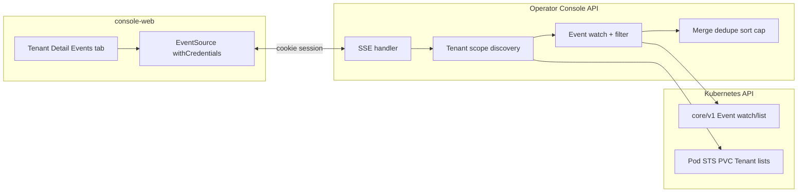

# Technical Design: Tenant Events SSE

**Status:** Draft  
**Scope:** `console` (Rust) + `console-web` (Next.js)  
**Related PRD:** [prd-tenant-events-sse.md](./prd-tenant-events-sse.md)  
**Updated:** 2026-03-29  

---

## 1. Goals (from PRD)

- Aggregate `core/v1` `Event` for **Tenant CR, Pod, StatefulSet, PVC** scoped to one tenant (see PRD §4 / §4.1).
- Deliver updates via **SSE** only; **remove** `GET /api/v1/namespaces/{ns}/tenants/{tenant}/events` (see PRD §5 / §7).
- Frontend: **no** separate HTTP fetch for events; **client-side** filters for type / kind / time.

### 1.1 PRD context (revision)

- **UX / loading:** The PRD §1 clarifies that the tenant detail view is typically **client-side routing** + full `loadTenant()` (or equivalent)—**not** necessarily a browser full-page reload. The Events sub-tab still could not incrementally refresh events alone before SSE; after SSE, **the Events tab self-updates** via the stream without requiring full `loadTenant()` for event rows (keep this distinction when testing and documenting).

- **Removing REST (product / engineering):** Dropping public `GET .../events` means **curl/scripts** cannot fetch merged JSON in one shot, and **integration tests** lean on **SSE clients** or **browser** (PRD §2 / §7). If the team chooses the **optional variant**, keep a **read-only ops/internal** JSON endpoint behind separate auth/networking—document the chosen path in deploy docs and OpenAPI.

---

## 2. Architecture

- **Discovery** reuses the same label/name rules as `list_pods` / `list_pools` + PVC list by `rustfs.tenant` (PRD §4.1).
- **Watch**: namespace-scoped `Event` stream, **in-memory filter** by `involvedObject` ∈ scope (see §3.3).
- **Transport**: SSE `text/event-stream`, each message body = full snapshot JSON `{ "events": [...] }` (PRD §5.1).

---

## 3. Backend (Rust / `src/console`)

### 3.1 Routes

| Action | Path |
|--------|------|
| **Add** | `GET /api/v1/namespaces/:namespace/tenants/:tenant/events/stream` |
| **Remove** | `GET .../tenants/:tenant/events` → delete route + `list_tenant_events` (per PRD) |

Register in [`src/console/routes/mod.rs`](src/console/routes/mod.rs) (`event_routes` or dedicated stream route). Merge in `api_routes()` in [`server.rs`](src/console/server.rs).

### 3.2 Module layout (suggested)

| Piece | Responsibility |
|-------|------------------|
| `handlers/events.rs` or `handlers/events_stream.rs` | Axum handler: auth `Claims`, build K8s client, spawn stream task |
| `tenant_event_scope.rs` (new) | `async fn discover_tenant_event_scope(client, ns, tenant) -> Result<Scope>`: pod names, STS names, PVC names, tenant name; **shared helpers** with `list_pods` / `list_pools` label strings (`rustfs.tenant=...`) and `{tenant}-{pool}` |
| Reuse `EventItem` / `EventListResponse` shape | Snapshot JSON field names stay stable for the UI; optional thin wrapper `EventSnapshot { events: Vec<EventItem> }` for SSE |

**Refactor note:** Extract `format!("rustfs.tenant={}", tenant)` and STS name building into a small module used by `pods`, `pools`, and `tenant_event_scope` to satisfy PRD §4.1 “single source of truth”.

### 3.3 Kubernetes interaction

**API version:** `core/v1` `Event` only in Phase 1 (PRD §3; aligns with existing `list_tenant_events`).

#### 3.3.1 Tenant `involvedObject.kind` (correction vs current code)

**Gap:** [`src/console/handlers/events.rs`](src/console/handlers/events.rs) today uses **only** `involvedObject.name={tenant}` in a field selector; it does **not** filter by `involvedObject.kind`. PRD §4 / §4.1 / §8 require **Tenant** rows to match **`kind` + `name`**, so a different resource kind with the same name could theoretically be mixed in.

**Fix (implementation contract):**

1. **Read the CRD Kind** used at runtime (e.g. constant aligned with `deploy/rustfs-operator/crds/` or `kubectl get crd`—typically **`Tenant`**). Store in `Scope` as `tenant_event_kind: String` (or `&'static str` if fixed).
2. **Filtering:** For every candidate `Event`, when attributing to the “Tenant CR” row, require:
   - `involved_object.name == tenant` **and**
   - `involved_object.kind == tenant_event_kind` (case-sensitive as returned by the API).
3. **List/watch strategy:** Kubernetes field selectors for `Event` may not support combining `involvedObject.kind` and `involvedObject.name` reliably across versions. **Recommended default:** namespace-scoped **list + watch** of `Event`, then **post-filter** all legs (Tenant / Pod / STS / PVC) in Rust—same code path for snapshot and watch updates. Optionally use field selectors where they reduce list size only after verification on target K8s versions.

**Scope set:** Build `involved: Set<(Kind, Name)>` with **fully qualified kind strings** as returned by `Event.involved_object.kind` (e.g. `Pod`, `StatefulSet`, `PersistentVolumeClaim`, `Tenant`).

#### 3.3.2 Scope discovery (initial + periodic refresh)

1. `Pod`: `Api::list` with `labels: rustfs.tenant=<tenant>` (same as [`handlers/pods.rs`](src/console/handlers/pods.rs)).
2. `StatefulSet`: same label; names must match `{tenant}-{pool}` for each `pool` in `Tenant` spec (same as [`handlers/pools.rs`](src/console/handlers/pools.rs)).
3. `PersistentVolumeClaim`: `Api::list` with `labels: rustfs.tenant=<tenant>`.
4. `Tenant`: name = path param; **kind** from CRD / constant (see §3.3.1).

**Filtering (watch path):**

- `watcher` / `WatchStream` on `Api<corev1::Event>` **in the namespace** (list+watch with `ListParams::default()` or minimal params).
- For each `Applied`/`Deleted` event, **accept** iff `(involved.kind, involved.name)` ∈ `Scope` (with kind matching rules above).
- On **reconnect**, use `resource_version` from last bookmark/object when possible (kube-rs patterns).

**Initial snapshot:** Before or right after watch starts, **list** events in namespace and filter the same way, then **dedupe / sort / cap 200** (PRD §5.1). Emit first SSE `data:` line immediately so the UI can render without a separate REST call.

**Periodic scope refresh:** Re-run discovery every **N** seconds (e.g. 30–60s) or when watch errors, so new Pods/PVCs enter the whitelist without requiring reconnect. Document chosen **N** in code comment.

### 3.4 Dedupe, sort, cap

- **Dedupe:** `metadata.uid` first; else weak key `(kind, name, reason, firstTimestamp, message)` (PRD §5.1).
- **Sort:** `lastTimestamp` / `eventTime` descending.
- **Cap:** default **200** events per snapshot (constant + comment for ops).

### 3.5 SSE response (Axum)

- `Content-Type: text/event-stream`
- `Cache-Control: no-cache`, `Connection: keep-alive` as appropriate
- Body: async **stream** of UTF-8 lines: `data: <json>\n\n`
- On **fatal** errors **before** stream starts → return **4xx/5xx JSON** (same error envelope as other console handlers), **not** an empty stream.
- On **watch failure after** stream started → optionally send a final SSE event with error shape **or** close connection; **do not** silently send endless empty snapshots (PRD §5.1).

**Compression:** SSE is long-lived; ensure `CompressionLayer` does not buffer the stream indefinitely (verify `tower-http` behavior or disable compression for this path if needed).

### 3.6 Auth

- **HTTP session:** Middleware uses **`session` cookie JWT** ([`middleware/auth.rs`](src/console/middleware/auth.rs)). **EventSource** sends cookies on same-site / credentialed CORS; frontend must use `{ withCredentials: true }` for cross-origin dev.
- **K8s API:** `Claims` still carries `k8s_token` for impersonated `kube::Client`—unchanged from other handlers.

**PRD note:** “JWT + user K8s token” in the PRD refers to this combined model; SSE does **not** use `Authorization` headers for browser transport.

### 3.7 OpenAPI

- Remove or mark deprecated old `GET .../events` in [`openapi.rs`](src/console/openapi.rs).
- Document `GET .../events/stream` (response = `text/event-stream`, example snapshot schema).

---

## 4. Frontend (`console-web`)

### 4.1 Transport

- **Prefer `EventSource`** with `{ withCredentials: true }` so the **session cookie** is sent (matches existing auth).
- Parse `message` events: `event.data` → JSON `EventListResponse`-compatible `{ events: EventItem[] }`.
- **URL:** `${apiBase}/api/v1/namespaces/${ns}/tenants/${tenant}/events/stream` (add helper next to removed `listTenantEvents`).

**Limitations (PRD §5.2):**

- Standard `EventSource` does **not** send custom `Authorization` headers; cookie session is the primary fit.
- If you ever move to **Bearer-only** auth, plan **fetch streaming** or **query token** (security review) instead of native `EventSource` with headers.

### 4.2 Lifecycle (Tenant detail client)

| Moment | Behavior |
|--------|----------|
| User opens **Events** tab | `EventSource` connect; show loading until first `data` or error |
| First `data` | `setEvents(parsed.events)` |
| Further `data` | Replace list with new snapshot (PRD: full snapshot each time) |
| SSE error / disconnect | Non-blocking **toast**; keep last good list; offer **Retry** (close + reopen EventSource) |
| `namespace` / `name` route change | **Close** EventSource, **clear** events state, open new stream |
| Leave page / unmount | `eventSource.close()` |

Do **not** load events in the initial `Promise.allSettled` batch that currently calls `listTenantEvents`; remove that call.

### 4.3 CORS and cookies

- Align with [`server.rs`](src/console/server.rs) `CORS_ALLOWED_ORIGINS` for dev split-host (e.g. Next on `localhost:3000`, API on another port).
- `credentials: "include"` for `fetch` is already used; **EventSource** must mirror with **`withCredentials: true`** so preflight + cookie behavior matches PRD §5.2 / §6.

### 4.4 Client-side filters (PRD §5.2 / §5.3)

- **Type:** `Normal` | `Warning` + optional “show raw / Other” for unknown `event_type`.
- **Kind:** multi-select `Tenant` | `Pod` | `StatefulSet` | `PersistentVolumeClaim`.
- **Name:** substring on `involved_object` or `involvedObject.name` if exposed separately in DTO.
- **Time:** filter by parsed `last_timestamp` (and `first_timestamp` if needed) within UI range.

Keep filter state **local** to the Events tab; do not add query params to SSE URL in Phase 1.

### 4.5 Types

- Reuse `EventItem` / `EventListResponse` in `types/api.ts`.
- Add const arrays / unions for **kind** and **type** enums (PRD §5.3).

### 4.6 i18n

- Reuse existing “No events” / error strings; add short strings for filter labels and retry if missing.

---

## 5. Non-functional

| Topic | Design choice |
|-------|----------------|
| **RBAC** | User must `list`/`watch` `events` and `list` pods, statefulsets, persistentvolumeclaims, tenants (same as today + PVC list). Document in deploy notes. |
| **Multi-replica Console** | SSE is sticky to one pod unless using a shared informer; PRD §6: document **ingress sticky sessions** or single replica for Phase 1. |
| **Gateway / proxy (PRD §6)** | Default **read timeouts** (e.g. Nginx **60s**) can **silently close** idle SSE connections → client reconnects. **Deploy checklist:** increase `proxy_read_timeout` (or Envoy equivalent) for the console API route; tune together with optional **server heartbeat** (comment lines) if needed. |
| **Limits** | One watch + periodic discovery per **active** SSE connection; cap snapshots at 200 rows. |

---

## 6. Testing & verification

| Layer | Suggestion |
|-------|------------|
| **Rust** | Unit tests for `Scope` building from fake `list` results; **Tenant kind filter** (same name, different kind → excluded); dedupe/sort/cap pure functions. |
| **E2E / manual** | PRD §8: Pod Warning ~15s; two tenants same NS isolation; tab close drops connection (server log); **§8.7** Tenant events only (`kind` + `name`). |
| **Integration** | Without REST, prefer **SSE client** (e.g. `curl -N` with cookie, or headless browser) or add **temporary internal** JSON endpoint if product selects PRD §7 variant. |
| **Frontend** | Component test: mock `EventSource` or stream parser; filter logic unit tests. |

**Project gate:** `make pre-commit` before merge.

---

## 7. Implementation order (suggested)

1. Extract shared **tenant scope** / label helpers; add **PVC** list by label (aligned with PRD §4.1).
2. Implement **Tenant kind** + `(kind, name)` filtering; remove reliance on name-only field selector for Tenant leg.
3. Implement **SSE handler** + snapshot pipeline; manual `curl -N` with cookie or browser.
4. **Remove** `GET .../events` and frontend `listTenantEvents`; wire **EventSource** on Events tab (`withCredentials`).
5. Add **filters** UI + polish errors / retry.
6. OpenAPI + CHANGELOG + **deploy notes** (sticky + **proxy read timeout** + optional ops-only REST variant if chosen).

---

## 8. Risks & follow-ups

| Risk | Mitigation |
|------|------------|
| High event volume in namespace | Namespace-wide watch + filter; tune refresh; monitor CPU. |
| `events.k8s.io` only clusters | Out of Phase 1; add later if needed. |
| EventSource CORS in dev | Align `CORS_ALLOWED_ORIGINS` and `withCredentials`. |
| Ingress/proxy idle timeout | **proxy_read_timeout** / equivalent; document in runbook (PRD §6). |
| REST removal | Scripts/tests use SSE or optional internal API; track in PRD §2 / §7 decision. |

---

*End of technical design.*
